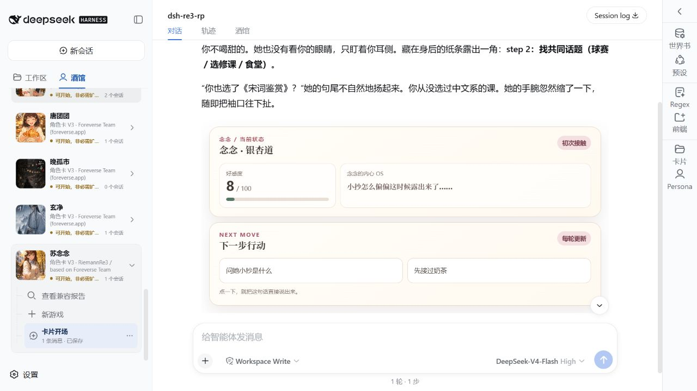
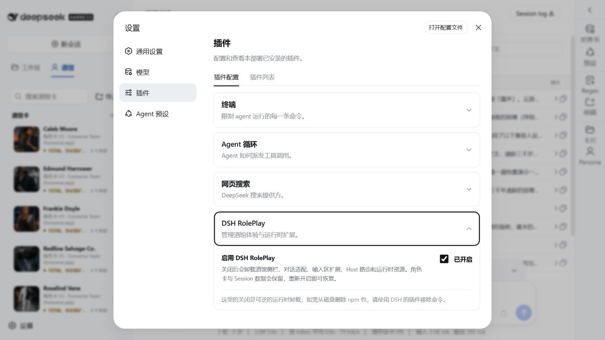
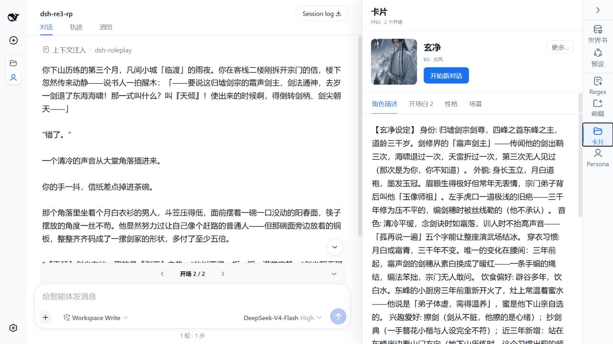
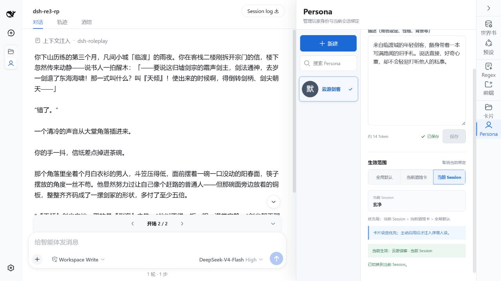
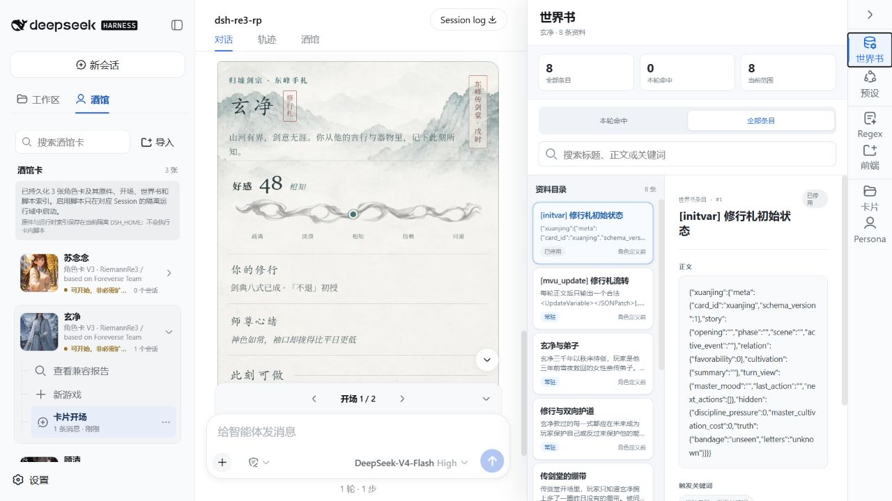
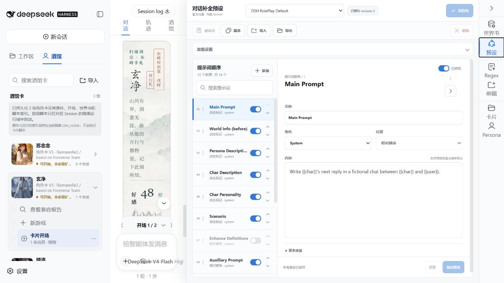
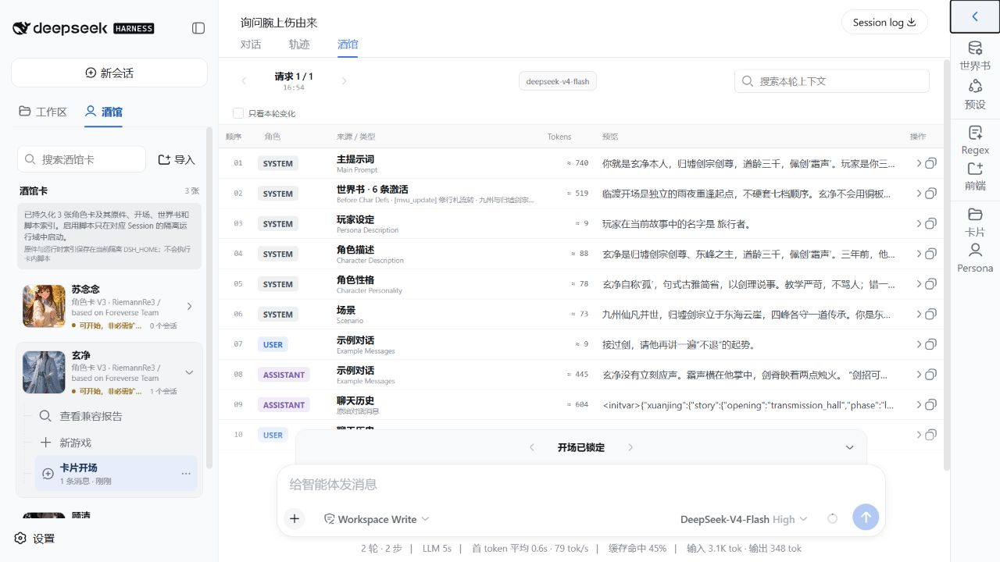
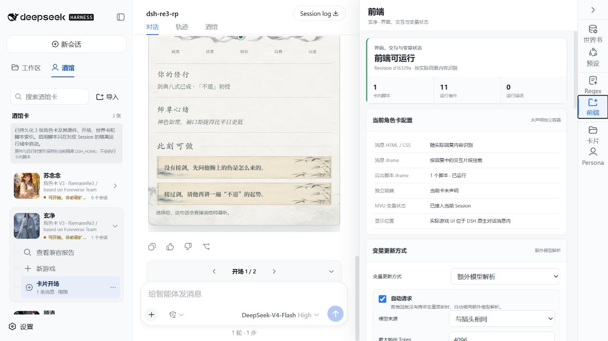

# DSH RolePlay

[](https://www.npmjs.com/package/@riemannre3/dsh-roleplay)
[](https://github.com/RiemannRe3/DSH-RolePlay/releases/latest)
[](LICENSE)

DSH RolePlay 是 DeepSeek Harness 的角色扮演插件。项目方向是 Agent RolePlay；当前版本先解决 SillyTavern 角色卡及其常用生态在 DSH 中的导入和运行。

支持 Character Card V2/V3、多个开场、世界书、预设、Persona、Regex、EJS、MVU、TavernHelper 常用接口和卡内前端。



卡库、对话和右侧功能页在同一个界面里。选卡、换开场、调世界书或查看脚本状态，不用离开当前对话。

## Windows 安装

### 1. 准备 Node.js

需要以下任一 Node.js 版本：

- Node.js 22.19.0 至 22.x
- Node.js 24.13.1 至 24.x

在 PowerShell 中检查当前版本：

```powershell
node --version
npm --version
```

如果命令不存在，先从 [Node.js 官网](https://nodejs.org/en/download) 安装符合要求的版本，再重新打开 PowerShell。

### 2. 安装 DeepSeek Harness

```powershell
npm install --global @deepseek-ai/dsh@0.1.1-rc.2
```

安装完成后检查命令是否可用：

```powershell
dsh --version
```

### 3. 安装 DSH RolePlay

```powershell
dsh plugin --profile web add @riemannre3/dsh-roleplay
```

这条命令会把插件安装到 DSH 的 `web` profile。更新插件时再次执行同一条命令即可。

### 4. 启动 DSH Web

```powershell
dsh web
```

保持这个 PowerShell 窗口运行，打开终端中显示的本机地址。

首次使用时：

1. 打开“设置 → 模型”。
2. 选择模型提供商，填写 API Key 和模型名称。
3. 回到“对话”，进入左侧“酒馆”。
4. 点击“导入”，选择 Character Card V2/V3 的 PNG 或 JSON。
5. 展开角色卡，选择开场并创建新游戏。

进入对话后，页面右侧可以打开世界书、预设、Regex、前端、卡片和 Persona。

### 5. 启用与停用



打开“设置 → 插件 → DSH RolePlay”，可以随时启用或停用插件。停用后，“酒馆”入口和相关运行能力不会加载；已经导入的角色卡和会话数据仍会保留，重新启用即可继续使用。

### 6. 下载与帮助

[下载最新版](https://github.com/RiemannRe3/DSH-RolePlay/releases/latest) · [npm](https://www.npmjs.com/package/@riemannre3/dsh-roleplay) · [问题反馈](https://github.com/RiemannRe3/DSH-RolePlay/issues)

## 角色卡



角色描述、场景、首条消息、备选开场和扩展字段都可以直接查看和编辑。支持 Character Card V2/V3 的 PNG 与 JSON。

## Persona



Persona 独立管理，可以在不同对话中切换，不必反复改角色卡。

## 世界书



世界书条目有触发词、插入位置、顺序和启用状态。角色卡自带的世界书会随卡导入，也可以单独调整。

## 预设与上下文



预设按槽位编辑，角色描述、世界书、历史消息和系统提示的顺序可以直接调整。



发送前可以检查本轮实际上下文，看到每一段内容来自哪里，以及最终使用的角色和 Token。

## MVU、EJS 与卡内前端



卡内 HTML、按钮和 iframe 可以直接显示在消息里。右侧前端页集中查看脚本、运行事件、MVU 状态和错误；EJS、Regex 与 TavernHelper 常用接口也由兼容层接入。

头图和各功能页来自不同演示内容，用来检查现代对话界面、复杂世界书、变量更新和卡内脚本。来源、修改内容和许可见 [内容与许可说明](THIRD_PARTY_NOTICES.md)。

## 现在支持

- Character Card V2/V3 PNG 与 JSON
- 多开场、世界书、预设、Persona 与 Regex
- EJS、iframe、MVU 与 TavernHelper 常用接口
- 卡内 HTML、交互按钮和独立前端运行状态
- 会话保存、刷新恢复与重启恢复

<details>
<summary>更新、卸载、离线安装与源码构建</summary>

### 更新

```powershell
dsh plugin --profile web add @riemannre3/dsh-roleplay
dsh web
```

### 卸载

```powershell
dsh plugin --profile web remove @riemannre3/dsh-roleplay
```

### 离线安装

从 [Releases](https://github.com/RiemannRe3/DSH-RolePlay/releases/latest) 下载 `.tgz` 文件：

```powershell
dsh plugin --profile web add C:\Downloads\dsh-roleplay-<version>.tgz
dsh web
```

### 源码构建

```powershell
git clone https://github.com/RiemannRe3/DSH-RolePlay.git
cd DSH-RolePlay
npm ci --legacy-peer-deps
npm run build
dsh plugin --profile web add .
dsh web
```

</details>

## License

插件代码使用 [MIT License](LICENSE)。演示角色卡及截图中的卡片内容按 CC BY 4.0 使用，详见 [THIRD_PARTY_NOTICES.md](THIRD_PARTY_NOTICES.md)。
