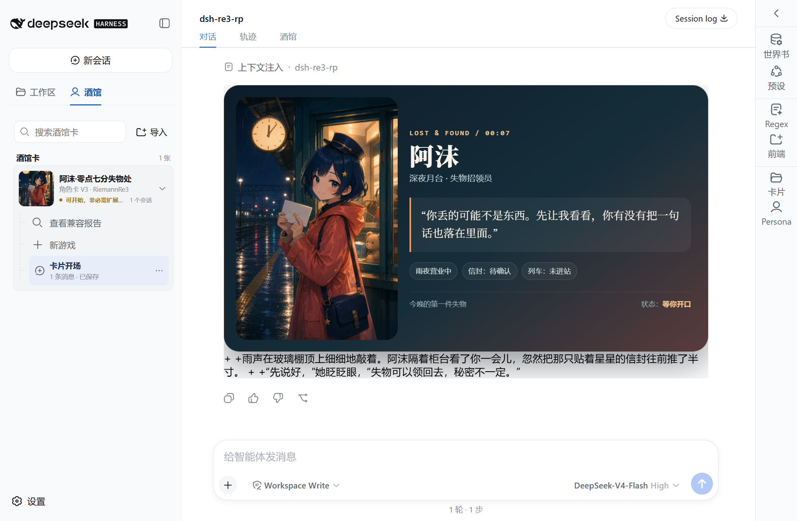
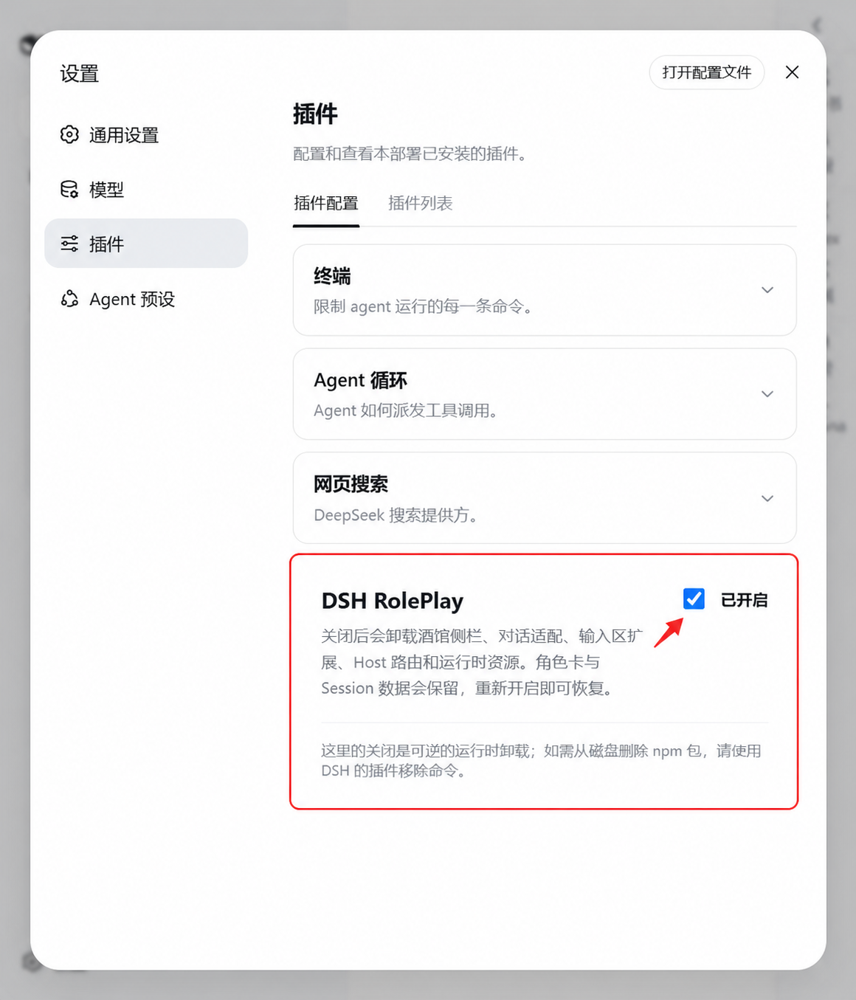

# DSH RolePlay

> 在 DeepSeek Harness 的原生 Session 里游玩 Tavern 角色卡。

`@riemannre3/dsh-roleplay` 是一个 DSH Web 插件，支持导入 Tavern Character Card V2/V3，并在原生 Conversation 中开始游玩。



## 环境要求

| 组件 | 最低已验证版本 | 说明 |
| --- | --- | --- |
| Node.js | `22.19.0` | 同时验证通过 `24.13.1`；推荐使用当前 Node.js 24 LTS |
| DeepSeek Harness | `0.1.1-rc.2` | 插件当前锁定并验证的 DSH 基线 |

不建议使用更早的 DSH 版本。它们缺少本插件依赖的 Web、Session 或插件运行时接口。

## Windows 安装

DSH RolePlay 直接从 npm Registry 安装，不需要先下载 GitHub Release 或 `.tgz` 文件。

先安装固定版本的 DSH：

```powershell
npm install --global @deepseek-ai/dsh@0.1.1-rc.2
```

让 DSH 从 npm 安装 DSH RolePlay、加入标准 Web Profile，然后启动 Web：

```powershell
dsh plugin --profile web add @riemannre3/dsh-roleplay
dsh web
```

`dsh plugin add` 会调用 DSH 自己的包管理器完成 npm 下载和 Profile 注册。不要改成普通的 `npm install @riemannre3/dsh-roleplay`：普通 npm 安装只会下载依赖，不会把插件加入 DSH Web Profile。

打开终端中显示的本机地址（默认是 <http://127.0.0.1:3080>），在“设置 → 模型”中配置模型和 API Key，再进入“酒馆”导入 PNG/JSON 角色卡。

停止 DSH 时，回到运行 `dsh web` 的终端并按 `Ctrl+C`。

更新插件时，停止 DSH 后重新运行同一条安装命令，再启动 Web：

```powershell
dsh plugin --profile web add @riemannre3/dsh-roleplay
dsh web
```

## 临时关闭与重新开启

打开“设置 → 插件 → 插件配置”，展开 **DSH RolePlay**，点击右侧复选框即可关闭或重新开启。



关闭是可逆的运行时卸载：酒馆侧栏、对话适配、输入区扩展、Host 路由、事件监听和运行时资源会被移除；角色卡与 Session 数据仍保存在当前 DSH Web Profile 中。重新开启后，插件会恢复这些界面和运行时能力。

## 从 Web Profile 移除

先停止正在运行的 DSH，再执行：

```powershell
dsh plugin --profile web remove @riemannre3/dsh-roleplay
```

这会从 Web Profile 移除 npm 包，不会主动删除插件已经保存的角色卡和 Session。重新安装到同一个 Profile 后仍可恢复；不要为了卸载插件删除整个 DSH 数据目录。

GitHub Release 中的 `.tgz` 只用于离线安装或 npm Registry 暂时不可用时的故障备用，不是推荐安装方式。

## 从源码构建

仅在开发或本地修改插件时需要源码构建：

```powershell
git clone https://github.com/RiemannRe3/DSH-RolePlay.git
cd DSH-RolePlay
npm ci --legacy-peer-deps
npm run build
dsh plugin --profile web add .
dsh web
```

`npm run build` 会编译 Host 代码，并生成 DSH Web 加载的单文件 Client Bundle。修改源码后，重新执行构建和 `dsh plugin --profile web add .`，再重启 DSH。

## 问题反馈

项目源码与问题反馈：[RiemannRe3/DSH-RolePlay](https://github.com/RiemannRe3/DSH-RolePlay)。请勿在 Issue 中公开 API Key、Token、私有角色卡或完整 Session Log。

## License

第一方代码使用 [MIT License](LICENSE)。
